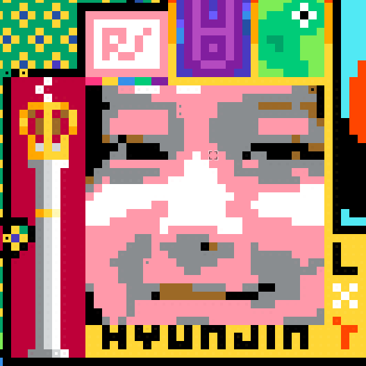
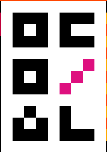
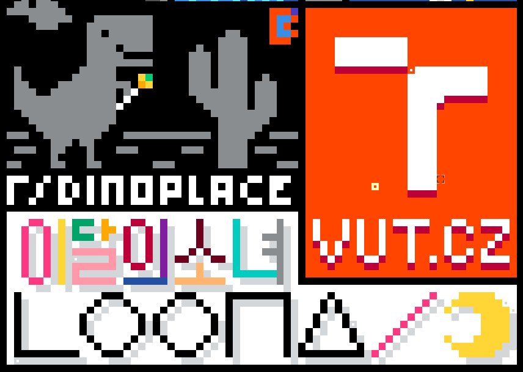
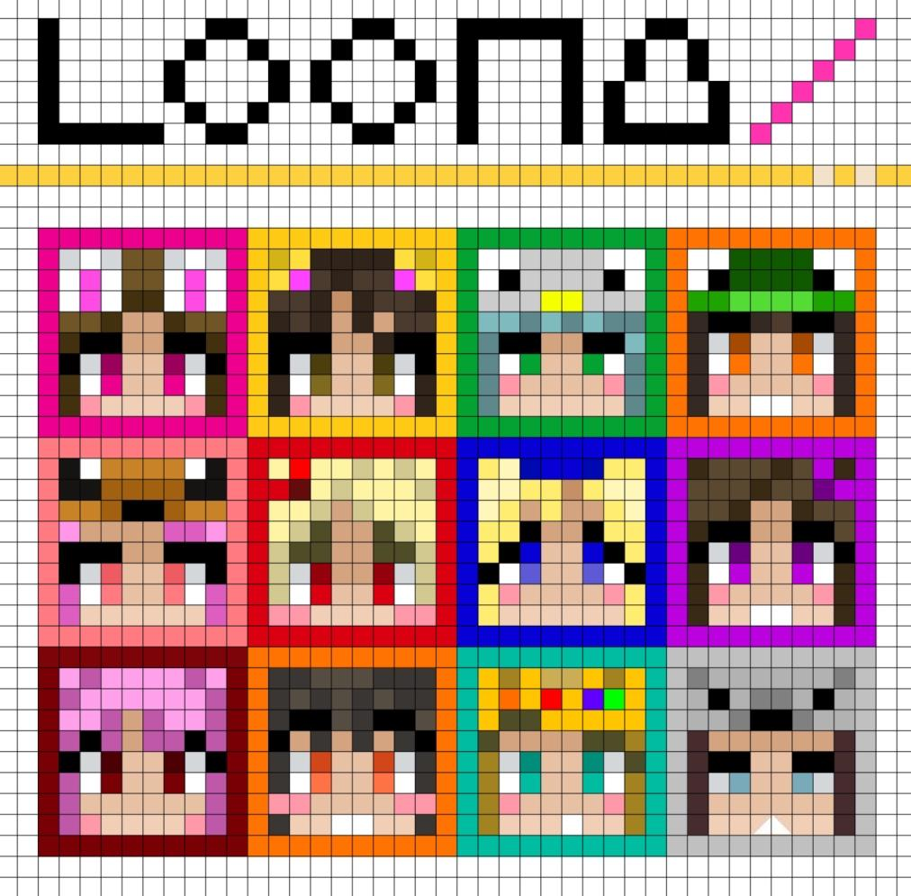

# VUTxLOONA

**THIS IS NOT A BOT THIS IS JUST A HELPER SCRIPT TO ASSIST YOU TO PLACE BLOCKS**

Pixel template for VUT and r/LOONA on r/place
- shows which color should be placed in which position

Instructions:
1. Install TamperMonkey https://www.tampermonkey.net/ in your preferred browsers (doesn't work work with firefox)
2. Click on https://github.com/DEM0N194/VUTxLOONA/raw/main/VUTxLOONA.user.js
3. Install the script and refresh r/place
4. Don't forget to update the script from time to time (step 2)

Places:

- (1330, 570)  vutez 

- (1290, 580) hyunface  

- (302, 780) main area LOONA and VUT.CZ 

- (1362, 570) friends sapari and cardiacs 

- (352, 1600) trojan chuu 

- (1394, 570) VUTxLOONA YIN YANG 

- (1670, 1585) ot12  NOT WORKING ON THIS

- (1168, 223) FIT.VUT.CZ 20 year anniversary 

- (511, 529) miniloona 

- (1633, 892) rloona 

Feel free to contribute by creating a pull request or tag me on discord @DEM0N94#0797

r/LOONA: https://discord.gg/8BfPEwrq

## All images

### rloona bottom left: 1633, 897

### trojan chuu bottom left: 352, 1635

### vut cardiacs yingyang bottom-left: 1330,599

### hyunface bottom-left: 1291,614

### mini-loona bottom-left 511,541

### loona-vut-main: bottom-left: 302, 830

### ot12-just-design we are not building this (we like the ducks there!): bottom-left: 1670,1585

